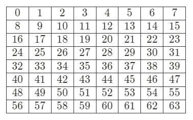

# Task 2. Don't Get Volunteered!

As a henchman on Commander Lambda's space station, you're expected to be resourceful, smart, and a quick thinker. It's not easy building a doomsday device and ordering the bunnies around at the same time, after all! In order to make sure that everyone is sufficiently quick-witted, Commander Lambda has installed new flooring outside the henchman dormitories. It looks like a chessboard, and every morning and evening you have to solve a new movement puzzle in order to cross the floor. That would be fine if you got to be the rook or the queen, but instead, you have to be the knight. Worse, if you take too much time solving the puzzle, you get "volunteered" as a test subject for the LAMBCHOP doomsday device!

- To help yourself get to and from your bunk every day, write a function called solution(src, dest) which takes in two parameters:
    - the source square, on which you start, and
    - the destination square, which is where you need to land to solve the puzzle.
- The function should return an integer representing the smallest number of moves it will take for you to travel from the source square to the destination square using a chess knight's moves (that is, two squares in any direction immediately followed by one square perpendicular to that direction, or vice versa, in an "L" shape).
- Both the source and destination squares will be an integer between 0 and 63, inclusive, and are numbered like the example chessboard below:

### Constraints 

- Your code will run inside a Python 2.7.13 sandbox. All tests will be run by calling the solution() function.
- Standard libraries are supported except for bz2, crypt, fcntl, mmap, pwd, pyexpat, select, signal, termios, thread, time, unicodedata, zipimport, zlib.
- Input/output operations are not allowed.
- Your solution must be under 32000 characters in length including new lines and and other non-printing characters.

### Test Cases

- Input: `solution.solution(0, 1)`
Output: 3

- Input: `solution.solution(19, 36)`
Output: 1